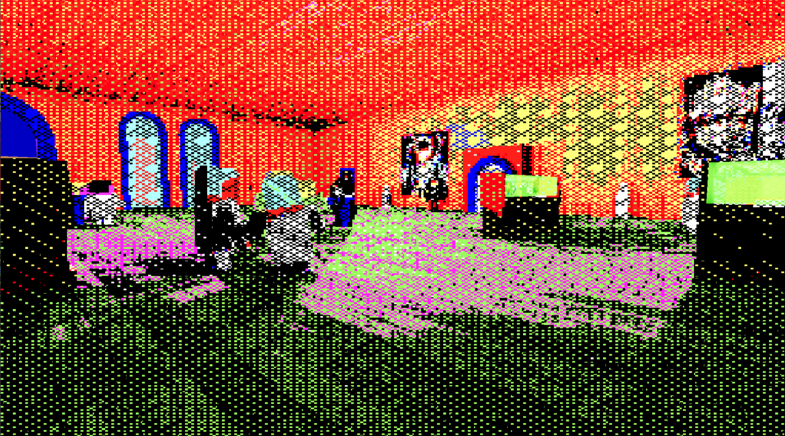
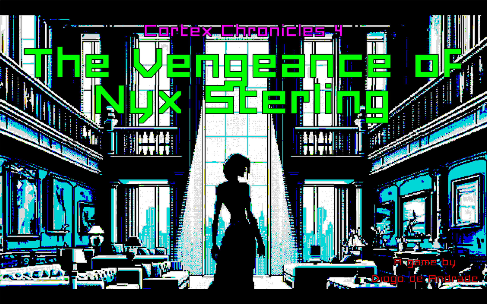
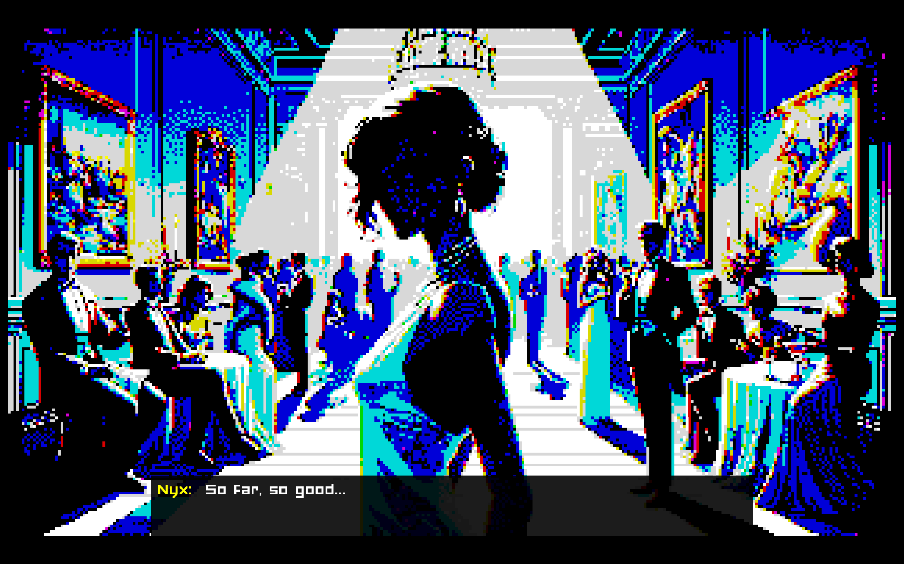
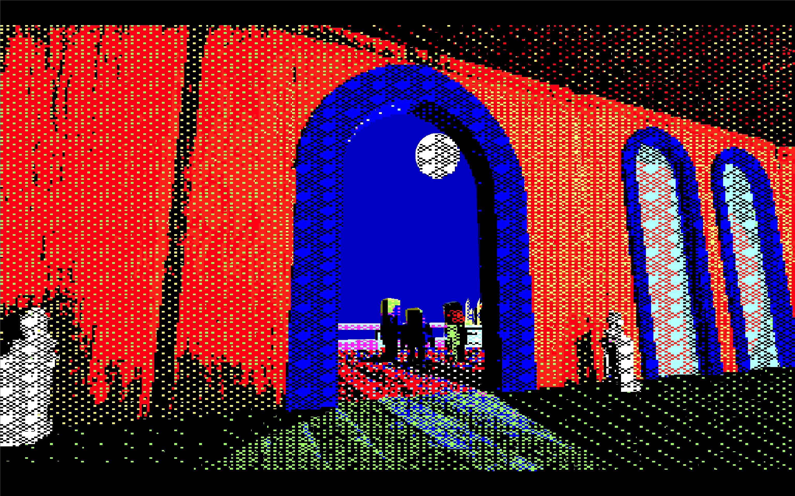
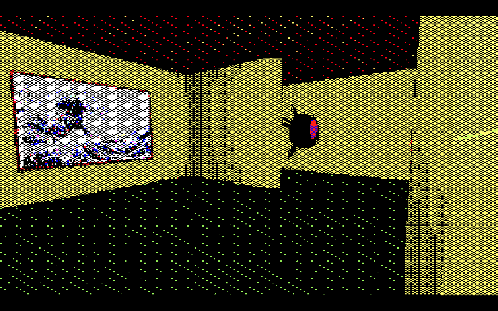
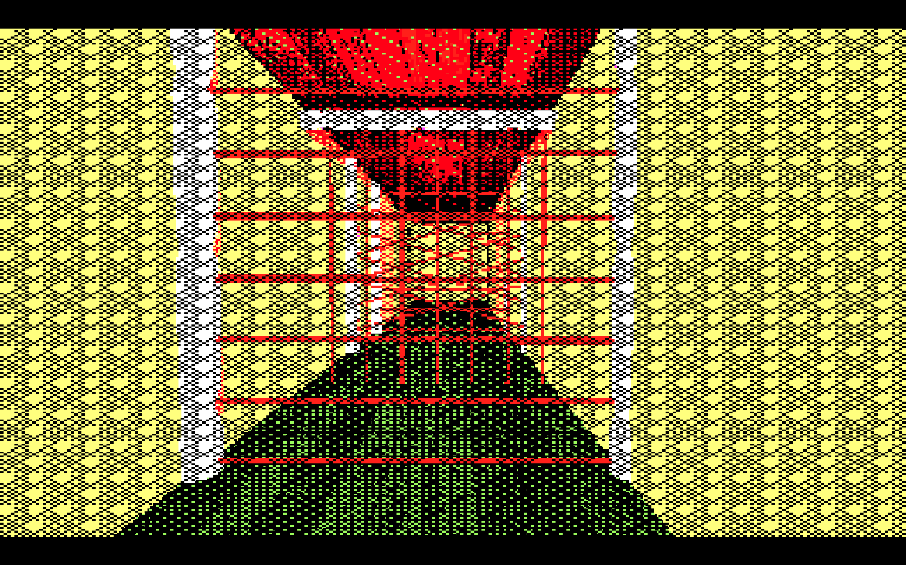
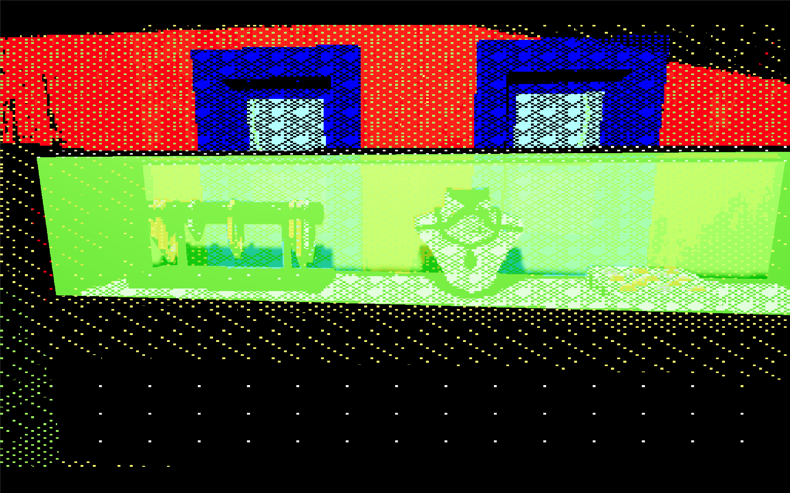
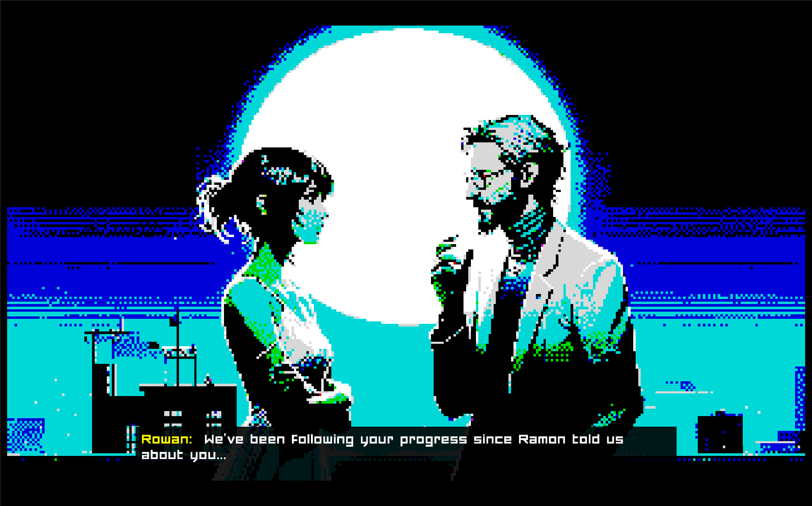

# THE CORTEX CHRONICLES, CHAPTER 4 - The Vengeance of Nyx Sterling

Developed for the Game Creator's Club at Lusofona University.
This month, the theme was "New Year Resolution", so the game is about a heist during a new year's party.

This time, I'm using Godot 4 with GDScript. I'm still learning, so don't expect amazing code!

This is a part of what I hope will be "The Cortex Chronicles" - I want all the games I do for the Game Creator's Club this year to be linked together, hence this idea.
I also want to use a different engine on every entry, so let's see how that goes! :)

Some of the assets aren't available on this repo (sorry), because they're from Synty and I can't distribute them (even if I have a license myself).

Final thoughts on Godot: I hate it. Making a game with it was painful. I don't like the structure, the general organization, it has a lots of small weird bugs. GDScript has all the bad things about Python, but none of the good (although I enjoyed being able to give stuff types), the "inspector" thing is very limited, the "prefab" system has the same sort of problems that pre-2017 Unity had (but none of the workarounds, it seems).
I know it's open source and it will get better, but I don't want to delve into the engine to be able to do something (if that was my goal, I'd do my own engine as I did in the past), and I believe it will still take a lot of time to be as good as other available engines.

Some thoughts on Dall-E. I've used it in this project, instead of Midjourney, and I like it a bit more because I can have a "conversation" with it and ask for tweaks. It's still very far from actually useful (I couldn't make him for example make a gun disappear from the character in some pictures, had to remove guns by hand!), but it's a nice experience.

## Art

- Drone by [NetSysFire]
- Remaining art was done by me (mostly with Asset Forge, and some Synty Studios props).
- [Dall-E] was used, all filtered with a shader I designed to give a [retro 3d look], and with some Photoshop for the static images.

## Licenses

- All game source code by Diogo de Andrade is licensed under the [MIT] license.
- Drone by [NetSysFire], available throught the [CC0] license.
- Some props by [Synty Studios] - can't be used freely so not included in this repo
- Font [Forced Square] by Friendly Fonts, free for personal use.
- All remaining art by Diogo de Andrade, available throught the [CC0] license.

## Screenshots

## Metadata

- Autor: [Diogo Andrade]

[Diogo Andrade]:https://github.com/DiogoDeAndrade
[Dall-E]:https://openai.com/dall-e-3
[Synty Studios]:https://www.syntystudios.com/
[NetSysFire]:https://opengameart.org/users/netsysfire
[CC0]:https://creativecommons.org/publicdomain/zero/1.0/
[Forced Square]:https://www.dafont.com/pt/forced-square.font
[retro 3d look]:https://github.com/DiogoDeAndrade/dithered_palette
[MIT]:LICENSE
